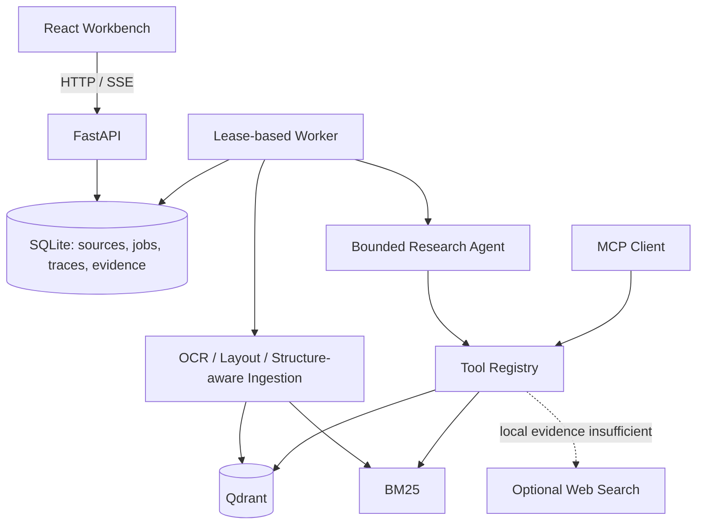
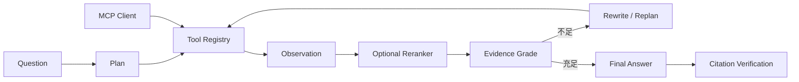
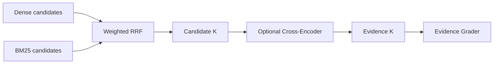
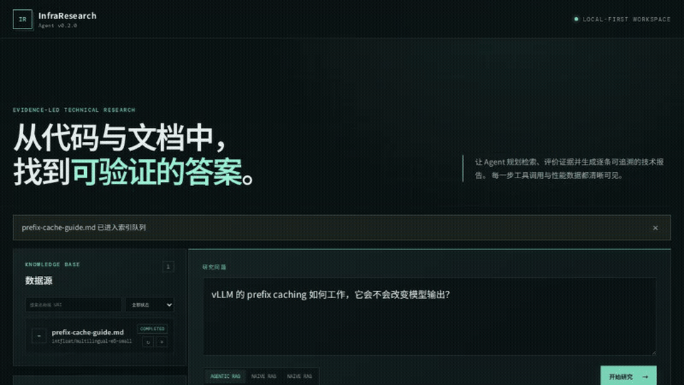

# InfraResearch Agent

面向基础设施与系统软件资料的可解释 Agentic RAG 工作台。它可以索引扫描 PDF、
双栏论文、Markdown、符号级代码、网页、公开 GitHub 仓库及 Issue，并以页码、bbox、
行号、commit 和 URL 生成可核验的技术报告。默认使用 FastEmbed 与
`multilingual-e5-small`；固定离线 Demo 使用哈希向量，不需要 GPU 或网络。

工作台支持来源状态持续刷新、重新索引和删除，也可以恢复最近研究记录并重试
因服务重启或外部错误失败的任务。导入和研究由 SQLite 持久队列中的独立 worker
执行，支持取消、崩溃恢复，以及来源/历史分页搜索。

## 架构



## Agent 如何运行



文档、代码和 GitHub Issue 检索具有统一的参数 Schema、结果上限、有限重试和错误
边界；本地 Agent 与 MCP Server 复用同一 Tool Registry。前端按顺序展示 Plan、
Tool Call、Observation、Rerank、Evidence Score、Decision 和 Final Answer。



PDF 文本层不足时触发可选 Tesseract OCR。布局解析保留标题、段落、表格/Caption、
双栏 reading order、page 与 bbox；Markdown 保留 heading hierarchy，代码优先按
class/function symbol 切分。文件 hash、Git commit 和 Issue `updated_at` 驱动增量索引。

## 已验证实验

固定 50 题包含多跳、模糊表达、精确术语、代码定位、Issue 联合检索及 5 道证据不足题。
以下是 2026-09-20 在 RTX 3060 Laptop 6GB 上的真实模型实验。两种模型均使用
vLLM 0.23.0、FP16、Qdrant Local + FastEmbed E5 + BM25/RRF、同一 50 题和语料、
`temperature=0`；主正确性评估引用修复前的模型答案，区间为 2,000 次 bootstrap
得到的 95% CI，避免引用修复掩盖模型差异。

| 模型 / 策略 | 原始正确性 [95% CI] | 原始 Citation Recall | 修复率 | 拒答准确率 | P50 |
|---|---:|---:|---:|---:|---:|
| Qwen3-0.6B / Naive | 0.717 [0.590, 0.833] | 0.347 | 0.72 | 0.82 | 3.17 s |
| Qwen3-0.6B / Fixed | 0.717 [0.587, 0.833] | 0.347 | 0.72 | 0.84 | 2.85 s |
| Qwen3-0.6B / Agentic | 0.783 [0.667, 0.880] | 0.447 | 0.60 | 0.90 | 3.01 s |
| Qwen3-1.7B / Naive | 0.803 [0.717, 0.883] | 0.677 | 0.40 | 0.88 | 8.57 s |
| Qwen3-1.7B / Fixed | 0.793 [0.700, 0.883] | 0.670 | 0.32 | 0.88 | 8.75 s |
| Qwen3-1.7B / Agentic | 0.837 [0.763, 0.903] | 0.680 | 0.34 | 0.94 | 8.56 s |

同口径复测后，1.7B 在 Naive、Fixed、Agentic 上分别比 0.6B 高 0.087、0.077、
0.053；对应配对 95% CI 均跨零，所以结论是“本次点估计更高”，而非已证明模型尺寸
带来显著提升。旧实验中“1.7B 不如 0.6B”的点估计不再成立。Agentic 相对 Naive 的原始
正确性差值为：0.6B `+0.067 [-0.007, +0.147]`，1.7B
`+0.033 [-0.040, +0.113]`；两者区间均跨零，因此不宣称统计显著提升。

| 独立 Retrieval Benchmark | Recall@1 | Recall@3 | Recall@5 | Recall@10 | MRR | nDCG@10 |
|---|---:|---:|---:|---:|---:|---:|
| FastEmbed E5 + BM25 / RRF | 0.857 | 0.863 | 0.883 | 0.890 | 0.885 | 0.978 |

Prefix Cache 控制实验使用 Qwen3-0.6B、同一 API/Worker/语料和五次重复问题。开启后
热态 TTFT 中位数从 80.9 ms 降到 49.7 ms（`-38.5%`），命中/查询计数增量为
2,688/2,716。1/4/8/16 并发各 16 请求均最终成功；关闭组高并发观测出现过可重试
传输错误，原始记录没有隐藏这一环境噪声。

| Prefix Cache | 热态 TTFT P50 | 并发 1/4/8/16 成功率 |
|---|---:|---:|
| Off | 80.9 ms | 1.00 / 1.00 / 1.00 / 1.00 |
| On | 49.7 ms | 1.00 / 1.00 / 1.00 / 1.00 |

原始输出见 [0.6B 报告](evals/results/roadmap-50q-qwen3-0.6b-full-v2/comparison.md)、
[1.7B 报告](evals/results/roadmap-50q-qwen3-1.7b-full-v2/comparison.md)与
[模型配对比较](evals/results/model-comparison-qwen3.json)、
[缓存对比](evals/results/runtime-prefix-comparison.json)。离线控制实验仍保存在
[`roadmap-50q-hybrid`](evals/results/roadmap-50q-hybrid/comparison.md)。

`make fault-injection` 的实际 SIGKILL 验收中，首个 Worker 退出码为 `-9`，替代
Worker 将过期 lease 重领为第 2 次 attempt，并一致地完成 2,143 个 chunks。
`make stress-ingestion` 的合成压力夹具覆盖 120 页可搜索 PDF、1,000 个源码文件和
500 个 Issue（共 2,620 chunks）；本机解析/写入分别为 0.048 s、0.134 s、0.033 s，
BM25 Top-10 为 28.2 ms。它隔离测量本地 ingestion，不包含 GitHub 网络或 OCR 模型
耗时；原始结果见 [`stress-ingestion.json`](evals/results/stress-ingestion.json)。

领域化 Query Rewrite 在离线控制实验中从零提升到 3/20 次成功；真实模型 Agentic
实验的成功率为 2/22。它仍是后续主要优化点。历史 Cross-Encoder 实验见
[实验总结](evals/results/benchmarks/summary.md)，项目不把退化包装成提升。

## Case Studies

1. **Evidence 足够，首次 Early Stop（q29）**：问题询问“marker 存在是否足以证明
   claim 忠实”。首次检索命中 `corpus.md#L64-L69`，Evidence Recall、Citation Recall
   与 Faithfulness 均为 1.0；Agent 只运行一轮并直接生成。
2. **Evidence 不足 → Rewrite → 拒答（q23）**：模糊查询“语义搜索和字面匹配怎么
   一起用”连续三轮未达到阈值。Trace 完整记录两次 Query Rewrite、9 次 Tool Call
   及最终 `refuse`；本次失败案例得分为 0，没有用不相关证据强答。
3. **错误引用修复**：自动化场景让 provider 生成
   `The production cluster runs on Mars [S1]`。marker 虽合法，但 claim/evidence 支持分
   低于阈值，Citation Verifier 用登记 Evidence 重建报告；测试同时断言错误 claim 被移除、
   修复后引用有效。见 `test_registered_marker_with_unsupported_claim_is_repaired`。



## 快速开始

要求 Python 3.12、Node.js 20+。GPU 不是基础演示的必需条件。

```bash
make install
make demo
```

打开 <http://localhost:5173>。后端 API 和交互文档分别位于
<http://localhost:8000/api/v1/health> 与 <http://localhost:8000/docs>。

`make demo` 使用固定 `evals/corpus.md`、SQLite/BM25 与抽取 provider，现场无需网络。
已有 Docker 的环境也可运行 `make docker-demo`。常规开发配置仍使用
`cp .env.example .env && make dev`。

也可以分别运行 API 与 worker：

```bash
uv sync --project backend --extra dev
# 终端 1
make backend
# 终端 2
make worker
```

默认会在 `data/` 保存 SQLite、Qdrant Local 和仓库副本。没有可用的
OpenAI-compatible 服务时，系统自动使用确定性抽取式 provider，并在运行结果中
标记 `provider=extractive`。

## 常用命令

```bash
make test          # 后端与前端单元测试
make check         # Python lint + TypeScript 类型检查
make build         # 前端生产构建
make demo          # 固定数据集、无需网络的一键 Demo
make docker-demo   # Docker Compose 启动 API、Worker 与前端
make evaluate      # 运行 50 题三种 Agent 决策策略评测
make evaluate-reranker # 使用 FastEmbed Cross-Encoder 运行评测
make evaluate-gpu  # 使用实际 Qwen、Qdrant 和 E5 运行 50 题评测
make compare-models # 校验实验配置并生成跨模型配对 bootstrap 比较
make benchmark-runtime # 重复查询与 1/4/8/16 并发压测
make stress-ingestion # 120 页 PDF、千文件 Repo、500 Issues 合成压测
make fault-injection # SIGKILL Worker 并验证 lease recovery
make preflight     # 检查 GPU、模型端点和目录
make verify        # 完整离线验收
make verify-gpu    # 验证实际 GPU/vLLM、8K context 和 prefix cache
make verify-ocr    # 使用 image-only PDF 验证真实 Tesseract OCR 与 bbox
make worker        # 单独启动持久任务 worker（make dev 已包含）
make mcp           # 通过 stdio 启动 MCP Server
```

RTX 3060 Laptop / WSL 环境可使用 `make setup-vllm` 创建独立持久环境，然后运行
`make start-vllm`。预下载模型路径通过 `INFRARESEARCH_VLLM_MODEL_PATH` 指定。

详细资料：

- [快速开始](docs/quickstart.md)
- [用户手册](docs/user-guide.md)
- [开发指南](docs/development.md)
- [架构与数据流](docs/architecture.md)
- [API](docs/api.md)
- [配置](docs/configuration.md)
- [测试](docs/testing.md)
- [故障排查](docs/troubleshooting.md)
- [MCP 工具服务](docs/mcp.md)
- [升级任务与验收](docs/agent-project-upgrade-goal.md)
- [项目总结与简历素材](docs/project-resume-summary.md)
- [当前面试与简历指南](docs/interview-guide.md)
- [Roadmap 实施与验收状态](docs/roadmap-status.md)
- [v0.3.0 发布说明](docs/release-v0.3.0.md)

## 项目结构

```text
backend/     FastAPI、索引、Tool Registry、MCP、Agent 和持久化
frontend/    React 研究工作台
evals/       50 题困难/拒答数据集、逐题结果与报告模板
scripts/     预检、评测和本地服务脚本
docs/        架构、API、配置、测试和运维文档
```

## 版本

当前课程原型版本为 `v0.3.0`。范围和非目标见 [PLAN.md](PLAN.md)，变更记录见
[CHANGELOG.md](CHANGELOG.md)。
