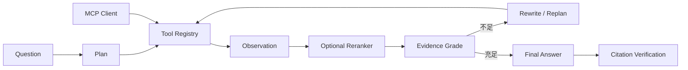

# InfraResearch Agent

面向基础设施与系统软件资料的可解释 Agentic RAG 课程原型。它可以索引本地
PDF/Markdown/代码或公开 GitHub 仓库，并以稳定的页码、行号和 Issue 链接生成
可验证的技术报告。默认使用 FastEmbed 与 `multilingual-e5-small` 生成真实语义
向量；无网络的最小演示可显式选择哈希向量回退。

工作台支持来源状态持续刷新、重新索引和删除，也可以恢复最近研究记录并重试
因服务重启或外部错误失败的任务。导入和研究由 SQLite 持久队列中的独立 worker
执行，支持取消、崩溃恢复，以及来源/历史分页搜索。

## Agent 如何运行



文档、代码和 GitHub Issue 检索具有统一的参数 Schema、结果上限、有限重试和错误
边界；本地 Agent 与 MCP Server 复用同一 Tool Registry。前端按顺序展示 Plan、
Tool Call、Observation、Rerank、Evidence Score、Decision 和 Final Answer。

## 已验证实验

固定20题、SQLite 词法召回和确定性抽取 provider 的离线消融结果如下。它用于验证
管线和控制变量，不代表真实 Qwen 的最终质量。

| Agentic 配置 | 正确性 | Citation Recall | Recall@K | P50 | 平均 Tokens |
|---|---:|---:|---:|---:|---:|
| Identity，Evidence K=3 | 0.895 | 0.975 | 0.975 | 41.6 ms | 90.0 |
| Identity，Evidence K=5 | 0.901 | 0.975 | 0.975 | 46.3 ms | 140.5 |
| Identity，Evidence K=6 | 0.901 | 0.975 | 0.975 | 46.1 ms | 153.9 |
| Cross-Encoder，Evidence K=6 | 0.898 | 0.975 | 0.975 | 475.7 ms | 158.7 |

这组小语料上，Cross-Encoder 没有提高 Recall@K，正确性下降 0.003，并增加约
430 ms P50 延迟，因此项目不宣称 Reranker 已带来质量提升。完整逐题证据、失败
案例和实验限制见 [实验总结](evals/results/benchmarks/summary.md)。


## 快速开始

要求 Python 3.12、Node.js 20+。GPU 不是基础演示的必需条件。

```bash
cp .env.example .env
make install
make dev
```

打开 <http://localhost:5173>。后端 API 和交互文档分别位于
<http://localhost:8000/api/v1/health> 与 <http://localhost:8000/docs>。

也可以分别运行 API 与 worker：

```bash
uv sync --project backend --extra dev
# 终端 1
make backend
# 终端 2
make worker
```

默认会在 `data/` 保存 SQLite、Qdrant Local 和仓库副本。没有可用的
OpenAI-compatible 服务时，系统自动使用确定性抽取式 provider，并在运行结果中
标记 `provider=extractive`。

## 常用命令

```bash
make test          # 后端与前端单元测试
make check         # Python lint + TypeScript 类型检查
make build         # 前端生产构建
make evaluate      # 运行内置 20 题双基线评测
make evaluate-reranker # 使用 FastEmbed Cross-Encoder 运行评测
make evaluate-gpu  # 使用实际 Qwen、Qdrant 和 E5 运行 20 题评测
make preflight     # 检查 GPU、模型端点和目录
make verify        # 完整离线验收
make verify-gpu    # 验证实际 GPU/vLLM、8K context 和 prefix cache
make worker        # 单独启动持久任务 worker（make dev 已包含）
make mcp           # 通过 stdio 启动 MCP Server
```

RTX 3060 Laptop / WSL 环境可使用 `make setup-vllm` 创建独立持久环境，然后运行
`make start-vllm`。预下载模型路径通过 `INFRARESEARCH_VLLM_MODEL_PATH` 指定。

详细资料：

- [快速开始](docs/quickstart.md)
- [用户手册](docs/user-guide.md)
- [开发指南](docs/development.md)
- [架构与数据流](docs/architecture.md)
- [API](docs/api.md)
- [配置](docs/configuration.md)
- [测试](docs/testing.md)
- [故障排查](docs/troubleshooting.md)
- [MCP 工具服务](docs/mcp.md)
- [升级任务与验收](docs/agent-project-upgrade-goal.md)
- [项目总结与简历素材](docs/project-resume-summary.md)

## 项目结构

```text
backend/     FastAPI、索引、Tool Registry、MCP、Agent 和持久化
frontend/    React 研究工作台
evals/       20 题数据集与报告模板
scripts/     预检、评测和本地服务脚本
docs/        架构、API、配置、测试和运维文档
```

## 版本

当前课程原型版本为 `v0.2.0`。范围和非目标见 [PLAN.md](PLAN.md)，变更记录见
[CHANGELOG.md](CHANGELOG.md)。
