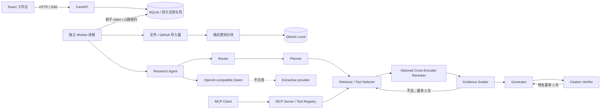

# 架构与数据流

SQLite 是任务、证据、引用和轨迹的事实来源。Qdrant 只保存 chunk ID、source ID 和
向量，因此可以安全地从 SQLite 重建。Qdrant 不可用时检索器切换为 SQLite 词法
检索，并在完成运行的指标中显示 `sqlite_lexical`。健康接口用于显示 API 配置；
实际执行路径以运行指标为准。

来源删除采用软删除：API 会立即把来源排除在检索之外并创建
`source_cleanup` job，worker 随后删除 Qdrant point；原始上传/仓库副本会清理。
SQLite 中的来源和 chunk 快照继续保留，使既有研究报告的证据抽屉仍可打开。

文档、代码和 Issue 检索通过同一个 Tool Registry 执行，统一进行 Pydantic 参数
校验、结果上限、有限重试、超时边界、取消检查和结构化错误记录。MCP Server 复用
该 Registry，并额外暴露 source、chunk 和历史 evidence resources；本地 Agent
无需绕行 MCP 网络层。

候选检索和最终 Evidence 数量分别由 `candidate_k` 与 `evidence_k` 控制。Identity
Reranker 保持原始召回分数；FastEmbed Cross-Encoder 同时保留
`retrieval_score` 和 `rerank_score`。精排失败时当次运行回退原始排序并记录
`reranker_status=degraded`。

Agent 状态包含问题、计划、检索轮次、证据、预算、答案和验证结果。每个节点边界
都会先持久化事件再继续，以便失败后仍能查看部分轨迹。v0.1.x 是单 Agent；
Retriever/Provider 接口是未来 MCP 和多 Agent 扩展边界。

API 不执行后台任务，只在同一事务中创建业务资源和 `jobs` 记录。独立 worker
以 compare-and-swap 原子领取最早的 pending job；心跳租约过期后会清理研究任务
的部分证据/轨迹并安全重排，导入则通过来源替换保持幂等。升级前遗留的 active
任务会在 worker 启动时自动接管。

取消采用 cooperative cancellation：API 将运行中的 job 置为
`cancel_requested`，worker 在 Git 命令、文件遍历、检索轮次、证据登记及模型
流式响应处检查；pending job 可直接转为 `cancelled`。Qdrant Local 只由 worker
进程持有，避免多进程同时打开本地 collection。

## 定位符

- PDF：`manual.pdf#page=12`
- 本地文件：`guide.md#L20-L46`
- 仓库：`owner/repo@sha/src/file.py#L10-L35`
- Issue：`owner/repo#issue-42 https://github.com/owner/repo/issues/42`
