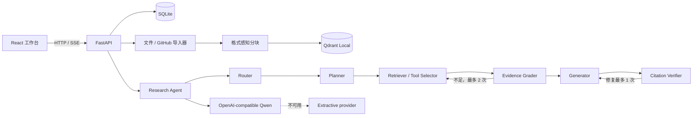

# 架构与数据流

SQLite 是任务、证据、引用和轨迹的事实来源。Qdrant 只保存 chunk ID、source ID 和
向量，因此可以安全地从 SQLite 重建。Qdrant 不可用时检索器切换为 SQLite 词法
检索，并在健康检查和运行指标中显示 `sqlite_lexical`。

Agent 状态包含问题、计划、检索轮次、证据、预算、答案和验证结果。每个节点边界
都会先持久化事件再继续，以便失败后仍能查看部分轨迹。v0.1.0 是单 Agent；
Retriever/Provider 接口是未来 MCP 和多 Agent 扩展边界。

## 定位符

- PDF：`manual.pdf#page=12`
- 本地文件：`guide.md#L20-L46`
- 仓库：`owner/repo@sha/src/file.py#L10-L35`
- Issue：`owner/repo#issue-42 https://github.com/owner/repo/issues/42`
