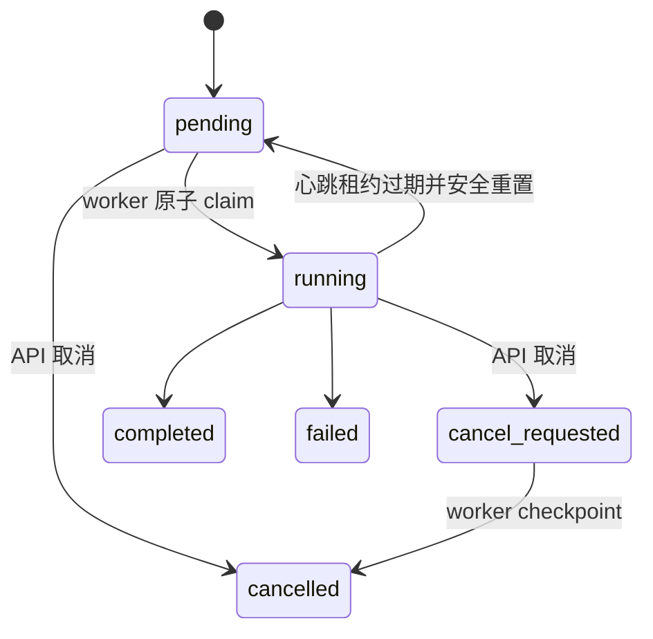

# 开发指南

本文面向修改 InfraResearch Agent 代码、任务执行路径或数据模型的开发者。首次使用
项目请先阅读[快速开始](quickstart.md)；环境变量集中记录在
[配置文档](configuration.md)。

## 开发环境

要求 Python 3.12、Node.js 20+、Git 和 `uv`。基础开发不要求 GPU。

```bash
cp .env.example .env
make install
make dev
```

`make dev` 同时启动三个进程：

| 进程 | 默认地址或入口 | 职责 |
|---|---|---|
| React/Vite | `http://127.0.0.1:5173` | 工作台与开发代理 |
| FastAPI | `http://127.0.0.1:8000` | 校验请求、持久化资源和 job、提供 HTTP/SSE |
| Worker | `python -m infraresearch.worker` | 导入、检索、生成、向量清理和任务恢复 |

需要分别观察日志时，在三个终端运行：

```bash
make frontend
make backend
make worker
```

只启动 API 是合法的：新任务会保持 `pending`，但不会执行。Qdrant Local 只能由
worker 进程持有；不要在 API 进程重新构造 `VectorIndex`，否则两个进程会争用同一
本地 collection。

## 代码导航

```text
backend/src/infraresearch/
  api.py          HTTP、SSE、分页查询与任务入队
  task_queue.py   job 创建、原子 claim、取消与租约恢复
  worker.py       独立执行循环、心跳与任务分派
  ingestion.py    文件、GitHub、Issue 导入与 cooperative cancellation
  agent.py        Router 到 Citation Verifier 的研究流程
  retrieval.py    FastEmbed、Qdrant Local 与 SQLite 词法回退
  provider.py     OpenAI-compatible 流式生成与 extractive 回退
  models.py       SQLAlchemy 持久模型
  schemas.py      公开 API 的 Pydantic 类型

frontend/src/
  App.tsx         页面状态、轮询、SSE 恢复和用户操作
  api.ts          HTTP/SSE client
  components.tsx  来源、历史、报告、证据和轨迹组件

scripts/
  verify.sh        分阶段验收编排
  smoke_api.py     隔离 API/worker 的真实 HTTP 验收
  verify_gpu.py    vLLM、长上下文和 prefix-cache 探针
  evaluate.py      固定 50 题检索与三种 Agent 策略评测
```

## 持久任务生命周期

API 必须在同一数据库事务中创建业务对象和 `jobs` 记录。当前 job 类型为
`ingestion`、`research` 和 `source_cleanup`。



worker 启动时先完成两类恢复：

1. 为升级前遗留但没有 job 的 active ingestion/research 创建持久 job。
2. 对超过 `WORKER_STALE_SECONDS` 没有心跳的 job 执行安全重排。

claim 使用带 `status=pending` 条件的 compare-and-swap 更新。多个 worker 即使同时
读到同一候选，也只有一个能把它改成 `running`。研究任务重排前会清理部分答案、
证据、引用、工具调用和轨迹；导入任务依靠 source replacement 重新执行。因此，
新增任务类型时必须先定义它的幂等策略，不能只把函数挂到 worker 分派表。

### 取消约定

pending job 可同步变成 `cancelled`。running job 先变成 `cancel_requested`，执行
代码在安全边界抛出 `TaskCancelled`。长循环或外部 I/O 必须加入 checkpoint：

- Git 子进程轮询和仓库文件遍历；
- 分块写入、Embedding 和向量替换前后；
- Agent 节点、检索工具与证据登记；
- 模型流式响应的每个数据块。

不要用强制终止线程模拟取消。新增终止状态时还要同步 SSE 退出条件、前端轮询、
状态筛选器和测试 fixture。

## API 与前端约定

- 数据库模型只负责持久化，`schemas.py` 是公开响应契约。
- 列表接口统一返回 `items/page/page_size/total/pages`，默认排序必须稳定。
- 新查询参数要同时覆盖空结果、分页边界、过滤组合和 OpenAPI schema。
- SSE 事件的 `sequence` 在单次研究中连续递增；终止事件是
  `run_completed`、`run_failed` 或 `run_cancelled`。
- 引用只能指向本次运行已登记的 evidence ID，不得生成占位 marker。
- 前端 SSE 断开后必须继续 HTTP 轮询，不能把连接中断当成任务失败。
- 修改 TypeScript API 类型时同步后端 Pydantic schema 和 Playwright mock。

当前前端类型为手工维护，并与 `/openapi.json` 对齐。引入自动生成 client 前应单独
记录 ADR，避免同时保留两套互相漂移的类型。

## 数据库和索引变更

SQLite 是业务事实来源，Qdrant 可以从 completed source 的 chunk 重建。开发时遵守：

1. `Base.metadata.create_all()` 只会创建缺少的表，不会修改已有列。新增或修改列前
   必须提供显式迁移方案；不要把 `create_all` 当成 schema migration。
2. 已生成报告依赖 `EvidenceRecord.content/locator` 快照。重建或删除来源不能删除
   历史报告所需的快照。
3. 修改 source/chunk 外键前，要在 `PRAGMA foreign_keys=ON` 下验证来源重建、
   软删除和历史报告读取。当前把 Evidence 快照与可变 Chunk 生命周期彻底解耦仍是
   后续迁移项。
4. Embedding 模型、维度或 chunk 参数属于索引指纹；变更后必须验证 collection
   重建以及 SQLite 词法降级。
5. 测试使用临时数据库和临时 Qdrant 目录，不得指向开发者的 `data/`。

查看本地队列时可使用：

```bash
sqlite3 data/infraresearch.db \
  'select id, kind, target_id, status, attempts, worker_id from jobs order by created_at desc limit 20;'
```

## 测试与调试

日常修改至少运行：

```bash
make test
make check
make build
```

提交前运行完整离线验收：

```bash
make verify
```

按阶段定位失败：

```bash
./scripts/verify.sh quality
./scripts/verify.sh unit
./scripts/verify.sh browser
./scripts/verify.sh api
./scripts/verify.sh evaluation
```

涉及 worker 时至少验证原子 claim、重复 `run_once`、租约恢复和取消；涉及 API 时
更新 `scripts/smoke_api.py`；涉及界面工作流时更新 Vitest 和 Playwright。GPU 或
生成 prompt 变更还要运行：

```bash
make verify-gpu
make evaluate-gpu
```

真实 GitHub 导入使用 `make verify-online`，共享出口限流不能视为代码通过。更完整
的测试范围见[测试指南](testing.md)。

## 代码与提交规范

- Python 由 Ruff 检查，目标版本为 3.12；TypeScript 保持 strict。
- 优先小而明确的模块边界，异常必须进入资源 `error` 或研究轨迹。
- 新 Agent 节点需说明进入条件、退出条件、重试上限和 token 影响。
- 保持现有 Retriever、Provider 和 Tool 接口，跨边界修改应增加 ADR。
- 使用 Conventional Commits：`feat:`、`fix:`、`test:`、`docs:`、`chore:`。
- 不提交 `.env`、Token、数据库、仓库副本、模型缓存或临时评测结果。

## 发布清单

1. 更新 `backend/pyproject.toml`、`backend/src/infraresearch/__init__.py` 和
   `frontend/package.json` 的版本。
2. 更新 `CHANGELOG.md`、README、API、配置、架构和测试文档。
3. 运行 `uv lock --project backend`；依赖未变化时不要无意义刷新 lockfile。
4. 运行 `make verify`，涉及模型路径时再运行 `make verify-gpu`。
5. 确认 `git diff --check`、工作树和生成文件，只提交预期内容。
6. 合并后创建带注释的 `vX.Y.Z` tag，并记录硬件相关验收结果。

故障定位入口见[故障排查](troubleshooting.md)，架构决策见 `docs/adr/`。
