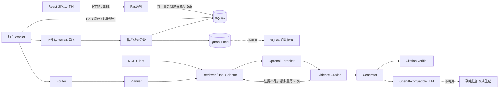

# InfraResearch Agent 项目总结与简历素材

> 文档基于仓库 `v0.2.0` 代码、架构文档、自动化测试与评测结果整理，重点从
> **Agent** 和 **Agentic RAG** 两个角度说明项目。简历表述可以直接选用，但应按
> 自己的实际职责将“独立完成”“负责”或“参与”替换准确。

## 1. 项目一句话介绍

InfraResearch Agent 是一个面向基础设施与系统软件资料的、可本地部署的
**可解释单 Agent Agentic RAG 研究工作台**。系统能够索引 PDF、Markdown、代码、
公开 GitHub 仓库及 Issue，由有界 Agent 完成问题路由、任务拆解、多工具检索、
证据评分、查询改写、答案生成和引用校验，最终输出带页码、代码行号或 Issue
链接的可验证技术报告。

项目并非只有“向量检索后调用一次 LLM”的传统 RAG，而是将检索增强生成建模为一条
可观测、可重试、可取消和可恢复的研究任务工作流。

## 2. 项目定位与解决的问题

### 2.1 业务问题

基础设施和系统软件的技术信息通常散落在以下位置：

- PDF 手册和设计文档；
- Markdown、配置文件与源代码；
- GitHub 仓库的特定版本；
- Issue 中的故障现象、修复过程和兼容性讨论。

普通聊天模型容易给出无法定位来源的答案；简单 RAG 又通常只有一次相似度检索，
难以同时覆盖文档、源码和 Issue，也缺乏对“证据是否足够”“引用是否真实”的判断。

### 2.2 项目目标

本项目围绕四个目标设计：

1. **可验证**：每条引用必须对应本次运行中登记的证据，并带稳定定位符。
2. **可解释**：前端实时展示 Agent 计划、节点状态、工具调用、证据和指标。
3. **可控**：限制查询重写次数、检索轮次、上传规模和生成上下文预算。
4. **可运行**：支持本地模型，也提供向量检索、生成服务不可用时的明确降级路径。

## 3. 技术架构

### 3.1 技术栈

| 层次 | 技术与职责 |
|---|---|
| 前端 | React 19、TypeScript、Vite；研究工作台、SSE 时间线、证据抽屉、数据源和历史管理 |
| API | FastAPI、Pydantic；请求校验、资源持久化、任务入队、分页搜索和 SSE 输出 |
| Agent | Python 自研有界状态机；Router、Planner、Retriever、Evidence Grader、Generator、Citation Verifier |
| 模型服务 | OpenAI-compatible Chat Completions；默认配置 Qwen3-0.6B，可对接 vLLM 等兼容服务 |
| Embedding | FastEmbed + `intfloat/multilingual-e5-small`，384 维；支持显式 Hash Embedding 回退 |
| 检索 | Qdrant Local 语义检索、SQLite 词法检索、代码关键词检索、GitHub Issue 检索 |
| 精排 | 可选 FastEmbed Cross-Encoder；保留召回分数与精排分数，失败时回退原始排序 |
| 工具协议 | Pydantic Tool Registry + MCP 2.x Tools/Resources；本地 Agent 直接复用工具实现 |
| 持久化 | SQLite + SQLAlchemy；保存任务、数据源、Chunk、Agent 轨迹、工具调用、证据、引用和指标 |
| 异步执行 | SQLite 持久任务队列 + 独立 Worker；原子领取、心跳租约、崩溃恢复和协作式取消 |
| 质量保障 | Pytest、Vitest、Playwright、Ruff、TypeScript strict、20 题 Naive/Agentic 双基线评测 |

### 3.2 总体数据流



### 3.3 关键架构原则

- **SQLite 是事实来源**：Qdrant 只保存向量及 Chunk/Source ID，可以从 SQLite
  中的有效 Chunk 重建。
- **API 与执行解耦**：API 不直接执行耗时导入和研究任务，只持久化业务对象与 Job；
  独立 Worker 执行任务。
- **先登记证据，再允许引用**：生成模型只能引用本次运行已登记的 `S1`、`S2` 等
  evidence ID。
- **失败路径可见**：实际使用的 Provider 和向量后端写入运行指标，避免把
  extractive 或 lexical fallback 误报成真实 LLM/向量运行。
- **Agent 行为有上限**：默认最多重写两次，即最多三轮检索；引用最多修复一次，
  避免无限循环和不可预测的资源消耗。

## 4. 从 Agent 角度理解项目

### 4.1 Agent 的定义

本项目中的 Agent 是一个**有界、可审计的单 Agent 状态机**。它持有问题、研究计划、
检索轮次、候选证据、Token 预算、生成结果和验证结果，并根据当前状态选择下一节点。

它的 Agent 特征包括：

- 对问题进行路由，区分闲聊与需要检索的研究问题；
- 将复杂问题拆成最多三个子问题，并识别所需证据类型；
- 根据证据类型选择文档、代码和 Issue 检索工具；
- 对检索结果做相关性、覆盖度和来源多样性评分；
- 证据不足时改写查询并再次检索；
- 在上下文预算内组织证据并调用生成 Provider；
- 校验答案引用，只允许使用真实登记的 evidence ID；
- 持久化每个节点、工具调用和证据事件，供前端回放。

### 4.2 Agent 节点设计

| 节点 | 输入 | 核心逻辑 | 输出或决策 |
|---|---|---|---|
| Router | 用户问题 | 识别简单闲聊是否需要检索 | 直接回复或进入研究流程 |
| Planner | 研究问题 | 拆分子问题，判断 `docs/code/issues/mixed` 证据类型 | 结构化 ResearchPlan |
| Retriever / Tool Selector | 子问题、证据类型 | 选择语义文档、代码关键词、Issue 工具 | 多工具候选 Chunk |
| Evidence Grader | 问题、候选证据 | 计算 relevance、coverage、diversity | 证据充分或触发查询重写 |
| Generator | 问题、受预算约束的证据 | 调用 OpenAI-compatible LLM 或抽取式 Provider | 带 `[Sx]` 引用的 Markdown 报告 |
| Citation Verifier | 报告、证据注册表 | 删除非法引用；无有效引用时用证据重建报告 | 可验证答案与引用记录 |

### 4.3 规划与工具选择

Planner 先按复合问题边界拆分子问题，再通过问题中的 `issue/bug/报错/故障`、
`code/function/class/实现/源码` 等信号判断证据类型。Retriever 根据类型选择：

- `semantic_document_search`：所有研究问题的通用语义检索；
- `code_keyword_search`：代码或混合证据问题的源码关键词检索；
- `github_issue_search`：故障或混合问题的 Issue 检索。

这使 Agent 能对不同数据形态采用不同工具，而不是把所有内容都交给同一个向量查询。
单个工具失败只记录失败状态，不会丢弃其他工具已经找到的证据。

### 4.4 证据评分与闭环

Evidence Grader 使用三个维度判断证据是否充分：

- **Coverage**：问题 Token 在候选证据中的覆盖比例；
- **Relevance**：Top 结果的平均检索分数；
- **Diversity**：证据是否来自多个 Source。

当覆盖度与相关性没有达到阈值时，Agent 为子查询补充
`documentation implementation configuration` 或
`error behavior example source` 等检索意图后重试。默认 `max_agent_rewrites=2`，
因此流程最多执行三轮检索。

这个闭环是项目相对 Naive RAG 的核心差异：Agentic 模式能够“检索—评价—改写—再检索”，
而 Naive 模式始终只按原问题执行一轮语义检索。

### 4.5 可解释与可观测

Agent 在节点边界持久化事件，主要事件包括：

- `run_started`；
- `node_started` / `node_completed`；
- `plan_created`；
- `tool_completed`；
- `evidence_added`；
- `evidence_graded`；
- `query_rewritten`；
- `token`；
- `run_completed` / `run_failed` / `run_cancelled`。

事件拥有单次运行内连续递增的 sequence。FastAPI 通过 SSE 推送事件，React 按顺序
呈现 Agent 时间线；SSE 断开后，前端自动切换 HTTP 轮询恢复最终状态。这样既能实时
观察 Agent 路径，也能在刷新或网络中断后恢复历史运行。

### 4.6 为什么选择单 Agent

`v0.1.x` 刻意采用单 Agent：

- 更容易保证状态可复现和执行上限；
- 更方便对检索、评分、改写和引用修复做单元测试；
- 更适合比较 Naive RAG 与 Agentic RAG 的差异；
- 避免多 Agent 协作引入额外通信成本、权限面和调试复杂度。

Retriever、Provider 和 Tool 保留了清晰边界；当前已将同一 Tool Registry
映射为 MCP Tools/Resources。Supervisor + 多研究子 Agent 仍属于路线图，
不应写成当前已实现能力。

### 4.7 Agent 实现边界

面试时建议主动说明：当前 Router、Planner、Evidence Grader、查询改写和工具选择
主要是**确定性规则/启发式策略**，LLM 负责基于证据生成报告；它不是让 LLM 自由
决定任意工具调用的开放式 Agent，也没有使用 LangChain/LangGraph。

这不是缺陷，而是项目为可复现、低资源和可测试目标做出的设计取舍。更准确的简历
表达是“自研有界 Agent 状态机”或“实现可控 Agentic workflow”，不宜写成
“实现完全自主智能体”。

## 5. 从 Agentic RAG 角度理解项目

### 5.1 数据接入与知识库构建

系统支持两类入口：

1. 上传 PDF、Markdown、文本和常见编程语言源码；
2. 导入公开 HTTPS GitHub 仓库，并可选同步最多 100 条 Issue。

GitHub 仓库使用浅克隆，可检出指定 revision，最终记录实际 commit SHA。后续引用
绑定该 SHA，避免默认分支变化后原始证据漂移。

系统还设置了数据安全边界：

- 只接受 `github.com` 的公开 HTTPS 仓库；
- 默认限制单文件 25 MB、单仓库最多 2,000 个可索引文件；
- 忽略 `.env`、凭据、私钥、证书、模型权重、二进制文件、`.git` 和构建产物；
- Git 子进程、文件遍历、分块和向量写入均支持取消检查。

### 5.2 格式感知分块与稳定定位

系统没有只做固定字符切分，而是根据资料类型保留可追溯结构：

- Markdown/RST：优先按标题切分，长章节再滑窗；
- 代码/文本：按行滑窗并保留行号；
- PDF：按页提取，再按段落控制 Chunk 大小；
- Issue：标题和正文组成独立 Chunk，并保存 Issue URL。

对应定位符示例：

```text
manual.pdf#page=12
guide.md#L20-L46
owner/repo@commit_sha/src/file.py#L10-L35
owner/repo#issue-42 https://github.com/owner/repo/issues/42
```

Chunk 保存内容哈希，证据登记阶段再按哈希去重，避免重复内容占用上下文和生成重复引用。

### 5.3 向量化与检索降级

默认使用 FastEmbed 加载 `multilingual-e5-small`，按照 E5 的要求分别为 passage 和
query 添加前缀，生成 384 维归一化向量并写入 Qdrant Local。

索引使用包含以下字段的 fingerprint：

- Embedding backend；
- Embedding model；
- 向量维度；
- Chunk size；
- Chunk overlap。

配置变化时自动重建 Collection；运行时若 Qdrant point 数与 SQLite 中有效 Chunk
数量不一致，也会从 SQLite 重建向量索引。

当 Qdrant 或 Embedding 不可用时，系统切换到 SQLite 词法检索。词法评分综合查询
Token 覆盖度与词频密度，并专门处理中文单字、二元组以及英文技术 Token。离线演示
还可以显式选择确定性 Hash Embedding。

### 5.4 多路检索

Agentic 模式组合三类检索：

| 检索工具 | 适用数据 | 主要实现 |
|---|---|---|
| 语义文档检索 | 文档、代码等所有 Chunk | E5 Embedding + Qdrant Cosine，相应失败时词法降级 |
| 代码关键词检索 | 标记为 code 的 Chunk | 关键词出现次数评分，过滤非代码数据 |
| GitHub Issue 检索 | Issue Source | 问题 Token 与 Issue 内容重叠度评分 |

来自不同工具和轮次的结果以 Chunk ID 合并，只保留同一 Chunk 的最高分，再按内容哈希
去重并选取 Top-K 证据。

### 5.5 证据管理与上下文预算

检索结果不会直接拼接给 LLM，而是先登记为不可变的 Evidence 快照：

- evidence ID；
- chunk ID 和 source ID；
- 原文内容；
- 稳定定位符；
- 检索分数；
- 元数据。

默认总 Token 预算为 6,000，生成前为系统提示和回答预留约 800 Token，其余预算按
约 4 字符/Token 对证据截断。即使截断进入模型的上下文，登记的 evidence ID 和
locator 仍保持不变。

来源重建或软删除后，历史运行仍保留证据内容和定位符快照，因此已生成报告的证据
抽屉可以继续打开。

### 5.6 Grounded Generation 与引用防幻觉

生成提示要求模型：

- 只能依据已登记证据回答；
- 输出简洁 Markdown 技术报告；
- 每个事实段落使用精确的 `[S1]` 形式引用；
- 不得创建未知 marker 或 locator；
- 不得输出 `<think>` 或私有推理内容。

对 Qwen3 请求显式关闭 thinking mode，服务端和前端还会再次剥离残留的
`<think>` 块。

Citation Verifier 在生成后执行：

1. 从答案中解析全部 `[Sx]`；
2. 校验 marker 是否属于本次运行的有效证据；
3. 删除不存在的 marker；
4. 如果存在证据但答案没有有效引用，则使用已登记证据生成抽取式报告；
5. 将 claim、marker、evidence ID 和有效状态持久化。

因此系统校验的是“引用是否指向真实登记证据”，能够防止伪造引用；当前版本还没有
对每个自然语言 claim 与证据做 NLI/LLM entailment 判定，简历中不应写成“完全消除
事实幻觉”。

### 5.7 Provider 与本地推理

Provider 对外使用 OpenAI-compatible Chat Completions，能够配置为 vLLM、Ollama
或其他兼容端点。默认模型配置为 `Qwen/Qwen3-0.6B`，支持流式读取、首 Token 时间
统计和 usage 汇总。

模型服务连接失败、响应异常或未返回有效文本时，系统使用确定性抽取式 Provider，
以保证无 GPU 环境和 CI 仍能演示完整流程。运行结果会明确记录
`provider=openai_compatible`、`extractive` 或 `rule_based`。

## 6. 工程化能力

### 6.1 持久任务队列

导入、研究和来源清理由 SQLite Job 驱动。API 在同一事务中创建业务对象与 Job，
避免出现“接口返回成功但任务没有入队”的不一致。

多个 Worker 领取任务时采用 compare-and-swap：

1. 读取最早的 `pending` Job；
2. 仅在状态仍为 `pending` 时更新为 `running`；
3. 根据受影响行数判断是否领取成功；
4. 竞争失败的 Worker 重新读取任务。

该机制防止多个 Worker 重复执行同一持久任务。

### 6.2 心跳租约与崩溃恢复

Worker 执行任务时定期更新 heartbeat。租约过期后：

- 研究任务会先清理未完成的答案、证据、引用、工具调用和轨迹，再安全重排；
- 导入任务通过 source replacement 保证重新执行的幂等性；
- `cancel_requested` 的过期任务直接转为 `cancelled`；
- Worker 启动时会为升级前没有 Job 记录的 active task 补建任务。

默认心跳间隔 2 秒，30 秒无心跳视为租约过期。

### 6.3 协作式取消

pending 任务可直接取消；running 任务先进入 `cancel_requested`，Worker 在安全
checkpoint 抛出取消异常。checkpoint 分布在：

- Git 子进程轮询；
- 仓库文件遍历和分块写入；
- Embedding 与向量替换前后；
- Agent 节点和检索轮次；
- 证据登记；
- LLM 流式响应的数据块。

与强杀进程相比，这种方式可以在明确边界停止任务并正确写回终止状态。

### 6.4 数据源生命周期

- 来源支持状态轮询、分页、过滤和文本搜索；
- 支持重新分块与重建向量；
- 删除采用软删除，立即从检索中过滤；
- Worker 异步清理 Qdrant point；
- 上传文件和仓库副本在受控目录内清理；
- 历史 Evidence 快照继续保留。

### 6.5 指标与可观测性

单次运行记录：

- Agent 步数；
- 检索轮次和工具调用次数；
- Prompt/Completion Tokens；
- 首 Token 时间 TTFT；
- 端到端延迟；
- 实际 Provider；
- 实际向量后端；
- vLLM prefix cache hit/query；
- KV cache usage。

聚合接口提供运行数、完成数、P50/P95 延迟、总 Token 和总工具调用次数。

## 7. Naive RAG 与 Agentic RAG 对比

| 维度 | Naive RAG | Agentic RAG |
|---|---|---|
| 查询 | 原始问题 | 先拆成子问题 |
| 工具 | 单次语义检索 | 按证据类型选择文档、代码、Issue 工具 |
| 检索轮次 | 固定 1 轮 | 证据不足时最多重写 2 次，共最多 3 轮 |
| 证据评价 | 无闭环 | 相关性、覆盖度、来源多样性评分 |
| 生成 | 使用同一 Provider | 使用同一 Provider |
| 引用验证 | 有 | 有 |
| 特点 | 快、成本低 | 复杂问题覆盖更好，但步骤和延迟更高 |

这种对比控制了 Chunk、Top-K 和生成 Provider 等主要变量，能更清楚地观察 Agentic
检索策略本身带来的收益和成本。

## 8. 评测设计与结果

### 8.1 评测方法

项目内置固定 20 题数据集，每题包含：

- 参考答案；
- 必需证据短语；
- 期望来源；
- 期望检索工具。

Naive 与 Agentic 模式使用同一语料、Top-K 和生成 Provider，统计：

- 正确性：参考答案 Token 在生成答案中的覆盖率；
- Citation Precision / Recall；
- Recall@K；
- 工具准确率；
- Agent 步数；
- Token 数；
- P50/P95 端到端延迟。

### 8.2 v0.1.1 真实模型评测

仓库保留的 live 评测使用 Qdrant Local 与 FastEmbed，结果如下：

| 模式 | 正确性 | 引用精确率 | 引用召回率 | Recall@K | 工具准确率 | 平均步数 | P50 延迟 | P95 延迟 | 平均 Tokens |
|---|---:|---:|---:|---:|---:|---:|---:|---:|---:|
| Naive | 0.749 | 1.000 | 0.717 | 0.975 | 1.000 | 5.00 | 2361.2 ms | 7454.9 ms | 756.2 |
| Agentic | 0.819 | 1.000 | 0.767 | 0.975 | 1.000 | 6.00 | 3723.5 ms | 9163.1 ms | 771.6 |

对结果的正确解读：

- Agentic 正确性提升约 **9.3%**（相对值，绝对值增加 0.070）；
- 引用召回率提升约 **7.0%**（相对值，绝对值增加 0.050）；
- 引用精确率、Recall@K 和工具准确率保持不变；
- 平均 Token 仅增加约 **2.0%**；
- P50 延迟增加约 **57.7%**，体现多工具检索和 Agent 节点的执行成本。

这组结果说明 Agentic workflow 在内置问题上改善了答案与证据利用，但换来了更高
延迟。它是 20 题小规模内部评测，不是生产 Benchmark；结果文件也没有完整固化
模型 revision 和硬件信息，因此简历中应表述为“内部 20 题 live 评测”。

### 8.3 离线可复现基线

确定性 extractive + SQLite lexical 的离线基线中，Naive 与 Agentic 的正确性均为
0.901、引用精确率均为 1.000、Recall@K 均为 0.975。它主要用于验证评测管线和
回归测试，也说明在小型、简单且检索充分的语料上，Agentic RAG 不一定天然优于
Naive RAG。

### 8.4 v0.2.0 Reranker 与 Top-K 消融

v0.2.0 将 Citation Recall 修正为“被引用证据对必需证据短语的覆盖率”，因此不能
将它与 v0.1.1 的旧定义直接比较。在固定20题、SQLite lexical 和 extractive
provider 下：

- Evidence K=5、6、8 的正确性均为0.901，Citation Recall 和 Recall@K 均为0.975；
- K=5 使用140.5平均 Token，低于 K=6 的153.9和 K=8的167.8；
- BGE Cross-Encoder 没有提高 Recall@K，正确性从0.901降至0.898；
- Cross-Encoder 将 Agentic P50 从46.1 ms增加到475.7 ms。

因此当前默认仍使用 Identity Reranker。简历可以描述已经实现两阶段检索和完整
消融，但不能宣称 Reranker 提升了当前数据集质量。完整结果见
[`evals/results/benchmarks/summary.md`](../evals/results/benchmarks/summary.md)。

## 9. 测试与当前验证状态

截至 2026-09-20，当前工作树已实际验证：

- 后端 Pytest：**46 passed**；
- 前端 Vitest：**9 passed**；
- Ruff 静态检查：通过；
- TypeScript 类型检查：通过；
- Vite 生产构建：通过；
- Playwright：**4 passed**，覆盖工作台渲染、数据导入、SSE 研究报告与
  引用证据、失败历史恢复与重试；
- `make verify`：通过，包含隔离 API/worker 工作流和20题双基线评测。

测试覆盖的重点包括：

- Markdown、代码、PDF 分块和稳定定位符；
- GitHub URL 安全限制、固定 SHA 和 Issue URL；
- Qdrant 来源替换与 SQLite 重建；
- Agent 最大重写轮次、Naive 单轮检索、工具失败隔离；
- 引用修复、无引用回退、Evidence 去重和 Token 预算；
- 多 Worker 原子 claim、租约恢复、旧任务接管、任务幂等和运行中取消；
- API 的文件到 Agentic 报告及 SSE 全链路；
- 前端数据源、历史、时间线、引用跳转和证据抽屉。

## 10. 项目亮点提炼

### 10.1 Agent 亮点

- 不依赖 Agent 框架，自研有界状态机，节点进入条件、退出条件和重试上限明确；
- 将规划、工具选择、证据评分、查询改写、生成和引用校验拆成可测试节点；
- 持久化 Agent trace 和 ToolCall，实现失败后诊断与历史回放；
- 单个工具失败可隔离，保留其他工具已获得的证据；
- 通过 Token、轮次和修复次数限制控制成本和最坏执行路径。

### 10.2 Agentic RAG 亮点

- 多数据源、多格式分块和 commit 级稳定引用；
- 语义、源码关键词、Issue 三类检索工具按意图组合；
- 证据评分驱动的自适应查询改写闭环；
- Evidence 注册表、内容哈希去重、上下文预算和引用验证；
- Qdrant/Embedding/LLM 都有可观测降级路径；
- 同一评测集对照 Naive 与 Agentic，量化质量、引用、延迟和 Token 权衡。

### 10.3 工程亮点

- SQLite 持久任务队列和 API/Worker 解耦；
- CAS 原子 claim、heartbeat lease、过期任务安全重排；
- 长任务协作式取消；
- Qdrant 与 SQLite 一致性检查和索引自动重建；
- SSE 实时轨迹加断线轮询恢复；
- 数据源软删除、重新索引、历史搜索和失败重试；
- 离线、GPU、真实 GitHub 分阶段验收设计。

## 11. 可直接用于简历的项目描述

### 11.1 项目名称

**InfraResearch Agent｜面向技术资料的可解释 Agentic RAG 研究系统**

### 11.2 一句话版本

基于 FastAPI、React、Qdrant、FastEmbed 和 OpenAI-compatible Qwen 构建可本地
部署的单 Agent Agentic RAG 系统，支持 PDF/代码/GitHub/Issue 多源检索、证据评分
驱动的查询改写、稳定引用校验、实时 Agent 轨迹及持久任务恢复。

### 11.3 推荐五条版

- 设计并实现有界单 Agent 工作流，将技术研究任务拆分为
  Router、Planner、Retriever、Evidence Grader、Generator 和 Citation Verifier，
  支持按证据类型选择语义文档、代码关键词和 GitHub Issue 工具，并在证据不足时
  最多执行 2 次查询改写。
- 构建多源 Agentic RAG 数据链路，支持 PDF、Markdown、代码与公开 GitHub 仓库/
  Issue 导入，采用 FastEmbed `multilingual-e5-small` + Qdrant Local 完成语义检索，
  保留 PDF 页码、代码行号和 commit SHA 级稳定证据定位。
- 建立 Evidence 注册与引用防幻觉机制，对候选内容按哈希去重并按 Token 预算装配
  上下文，约束模型仅引用本次运行的 `[Sx]` 证据；生成后校验并修复非法/缺失引用，
  内部 20 题 live 评测达到 1.000 引用精确率，Agentic 正确性相对 Naive 提升约 9.3%。
- 抽象文档、代码和 Issue 检索为带 JSON Schema、结果上限、有限重试和错误边界的
  Tool Registry，通过 MCP 2.x 暴露 Tools/Resources；实现可开关 Cross-Encoder
  两阶段精排及 Top-K 消融，并如实记录当前小语料上未产生质量增益的结果。
- 设计 SQLite 持久任务队列与独立 Worker，通过 CAS 原子 claim、heartbeat lease、
  过期任务安全重排和 cooperative cancellation 支持任务恢复；结合 SSE 展示 Agent
  节点、工具、证据与 Token 轨迹，并实现断线轮询恢复。

### 11.4 偏算法/大模型岗位版本

- 自研可控 Agentic RAG 状态机，通过问题拆解与证据类型识别动态组合语义、代码、
  Issue 检索工具，并基于 relevance/coverage/diversity 评分形成
  “检索—评价—改写—再检索”闭环。
- 使用 multilingual-e5-small 构建中英文技术语义索引，以 Qdrant Local 执行
  Cosine 检索；实现索引 fingerprint、向量/SQLite 一致性校验、词法与 Hash
  Embedding 降级，保证离线环境可复现。
- 构建 Grounded Generation 链路，将 Chunk 注册为带稳定 locator 的 Evidence
  快照，实施内容去重、上下文预算、引用白名单校验与无引用抽取式修复，减少伪造
  来源并支持逐条证据回溯。
- 设计 20 题 Naive/Agentic 对照评测，覆盖正确性、Citation P/R、Recall@K、
  工具准确率、Token 和 P50/P95 延迟；live 结果中 Agentic 正确性从 0.749 提升至
  0.819，引用召回率从 0.717 提升至 0.767。

### 11.5 偏后端/平台工程岗位版本

- 基于 FastAPI、SQLAlchemy 和 SQLite 搭建异步研究平台，API 只负责请求校验和
  事务内任务入队，由独立 Worker 执行导入、检索、生成和向量清理。
- 实现 SQLite 持久队列的 CAS 原子任务领取、心跳租约、崩溃恢复、遗留任务接管
  与协作式取消，按任务类型设计重排清理和 source replacement 幂等策略。
- 设计 SQLite 业务事实源 + Qdrant 可重建索引架构，实现配置 fingerprint、
  point 数一致性检查、来源重建/软删除和历史 Evidence 快照保留。
- 通过 SSE 实时推送 Agent 节点与工具事件，前端断线后自动 HTTP 轮询恢复；提供
  数据源和研究历史的分页搜索、取消、重试及指标聚合接口。

### 11.6 精简三条版

- 基于 FastAPI、React、Qdrant 和 Qwen 构建可解释 Agentic RAG 工作台，支持
  PDF/代码/GitHub/Issue 多源索引与页码、行号、commit SHA 级引用回溯。
- 自研 Router→Planner→Retriever→Grader→Generator→Verifier 有界 Agent 状态机，
  通过多工具选择、证据评分和查询改写闭环提升复杂技术问题的证据覆盖。
- 实现 Evidence 引用校验、SSE Agent 轨迹、SQLite 持久任务队列及 Worker
  租约恢复；20 题 live 评测中 Agentic 正确性相对 Naive 提升约 9.3%，引用精确率
  达 1.000。

## 12. 面试讲解模板

### 12.1 30 秒介绍

> 这是一个面向技术文档、源码和 GitHub Issue 的本地 Agentic RAG 系统。我没有把
> 它做成一次向量检索后直接生成，而是实现了一个有界单 Agent：先拆问题和判断证据
> 类型，再选择文档、代码或 Issue 工具；证据不足时评分并改写查询，最后对答案引用
> 做白名单校验。工程上用 SQLite 持久队列和独立 Worker 支持崩溃恢复与取消，前端
> 通过 SSE 展示完整 Agent 路径。20 题 live 对照评测里，Agentic 正确性相对 Naive
> 提升约 9.3%，但 P50 延迟也提高约 57.7%，因此项目重点是可量化质量与成本权衡。

### 12.2 2 分钟展开顺序

1. **为什么做**：技术答案需要定位到文档页、代码行和特定 commit，简单 RAG
   缺乏证据充分性判断。
2. **Agent 怎么工作**：问题路由、拆解、工具选择、证据评分、查询改写、生成和
   引用验证。
3. **RAG 怎么落地**：格式感知分块、E5 + Qdrant、多路检索、Evidence 快照和
   Token 预算。
4. **如何保证可靠**：引用白名单、索引重建、明确降级、持久任务、租约和取消。
5. **如何验证**：Naive/Agentic 使用同一语料和 Provider，比较质量、引用、检索、
   Token 与延迟。
6. **当前边界**：单 Agent、规则式规划和评分；MCP 和可选 Reranker 已实现，
   多 Agent、OCR 与 Web Search 尚未实现。

### 12.3 可重点回答的技术问题

#### 为什么不用 LangChain 或 LangGraph？

首版节点少且需要明确的重试、持久化和测试边界，自研状态机能减少框架隐式行为，
更直接地记录每个节点事件。未来节点数、分支和并发子任务增加时，可评估迁移到
LangGraph，但需要保留现有 Evidence 和 Tool 契约。

#### 如何防止模型伪造引用？

检索结果先注册为本次运行唯一的 `Sx` Evidence，模型只能看到这些 ID。生成后正则
提取引用并与白名单比对，删除非法 marker；若有证据但完全没有有效引用，则用已登记
证据重建抽取式报告。系统防止的是“marker/来源伪造”，不是完整的语义事实验证。

#### 为什么 SQLite 和 Qdrant 都要保存数据？

SQLite 保存业务事实、原文 Chunk、任务、轨迹和 Evidence；Qdrant 只保存向量与 ID，
可以丢弃重建。这样既能获得向量检索性能，也避免向量库成为唯一事实来源。

#### Worker 崩溃后为什么能恢复？

每个 running Job 有 heartbeat lease。Worker 超时后，恢复逻辑根据 Job 类型重置
部分状态：研究任务清除不完整派生数据，导入任务重新 replacement；然后把 Job
重新置为 pending。CAS claim 确保同一时刻只有一个 Worker 获得任务。

#### Agentic 为什么更慢？

它比 Naive 多了规划、工具选择、证据评分，并可能进行多轮检索。内部 live 评测中
正确性和引用召回更高，但 P50 延迟明显增加。生产化时应根据问题复杂度路由：
简单问题走 Naive，复杂或跨来源问题走 Agentic。

#### 下一步如何提高效果？

优先级建议：

1. 用学习式或 LLM Grader 替代固定阈值，并在离线集上校准；
2. 增加 BM25 + dense hybrid retrieval，并在更难评测集上校准已有 Cross-Encoder Reranker；
3. 改进代码 AST/符号分块和 PDF 表格/OCR；
4. 加入 claim-evidence entailment 验证；
5. 根据问题复杂度动态选择 Naive/Agentic 和检索预算；
6. 数据量增大后迁移服务化 Qdrant、正式数据库和分布式队列；
7. 在已有 MCP 工具契约上增加权限与观测，再评估 Supervisor 与并行子 Agent。

## 13. 简历关键词

可按岗位 JD 选择，不建议全部堆叠：

`Agent`、`Agentic RAG`、`RAG`、`Grounded Generation`、`Query Rewrite`、
`Tool Selection`、`Evidence Grading`、`Citation Verification`、`Semantic Search`、
`Hybrid Retrieval`、`Embedding`、`FastEmbed`、`multilingual-e5-small`、`Qdrant`、
`Qwen`、`vLLM`、`OpenAI-compatible API`、`FastAPI`、`React`、`TypeScript`、
`SQLite`、`SQLAlchemy`、`SSE`、`Persistent Job Queue`、`Lease Recovery`、
`Cooperative Cancellation`、`LLM Evaluation`、`Recall@K`、`Citation Precision`。

说明：当前系统的多路检索由 dense semantic、lexical、code keyword 和 issue
search 组成，可以描述为“多策略检索”；如果使用“Hybrid Retrieval”一词，面试时
应说明当前不是 BM25+dense 分数融合。Cross-Encoder Reranker 已实现，但当前离线
消融没有证明质量提升。

## 14. 不应过度描述的内容

以下能力属于路线图或只完成接口准备，不应写成已实现：

- 多 Agent 协作或 Supervisor；
- 知识图谱；
- OCR；
- Web Search；
- 用户认证、权限和多租户；
- 分布式 Qdrant 或生产级消息队列；
- 完整 claim-level 事实一致性验证；
- “彻底消除幻觉”；
- “大规模生产落地”或“高并发验证”。

当前项目更准确的定位是：**工程完整、可离线演示、可评测的课程/个人项目原型**。

## 15. 代码事实索引

| 能力 | 主要文件 |
|---|---|
| Agent 状态机、证据评分、引用校验 | [`backend/src/infraresearch/agent.py`](../backend/src/infraresearch/agent.py) |
| Embedding、Qdrant、词法/代码/Issue 检索 | [`backend/src/infraresearch/retrieval.py`](../backend/src/infraresearch/retrieval.py) |
| 两阶段精排与降级 | [`backend/src/infraresearch/reranking.py`](../backend/src/infraresearch/reranking.py) |
| Tool Registry、Schema 与重试边界 | [`backend/src/infraresearch/tooling.py`](../backend/src/infraresearch/tooling.py) |
| MCP Tools/Resources | [`backend/src/infraresearch/mcp_server.py`](../backend/src/infraresearch/mcp_server.py) |
| OpenAI-compatible 与抽取式 Provider | [`backend/src/infraresearch/provider.py`](../backend/src/infraresearch/provider.py) |
| 文件/GitHub/Issue 导入 | [`backend/src/infraresearch/ingestion.py`](../backend/src/infraresearch/ingestion.py) |
| 格式感知分块与安全过滤 | [`backend/src/infraresearch/chunking.py`](../backend/src/infraresearch/chunking.py) |
| 持久 Job、原子 claim 与租约恢复 | [`backend/src/infraresearch/task_queue.py`](../backend/src/infraresearch/task_queue.py) |
| Worker 心跳、取消和任务分派 | [`backend/src/infraresearch/worker.py`](../backend/src/infraresearch/worker.py) |
| HTTP、分页、SSE 和指标接口 | [`backend/src/infraresearch/api.py`](../backend/src/infraresearch/api.py) |
| React 工作台 | [`frontend/src/App.tsx`](../frontend/src/App.tsx) |
| 评测脚本 | [`scripts/evaluate.py`](../scripts/evaluate.py) |
| 评测方法 | [`docs/evaluation.md`](evaluation.md) |
| 架构说明 | [`docs/architecture.md`](architecture.md) |
